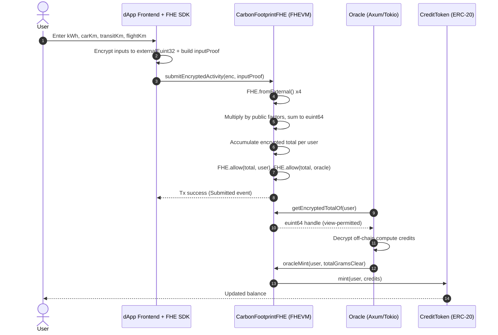

# Cibon - Carbon Footprint Calculator with FHE

A privacy-preserving carbon footprint calculator built on FHEVM (Fully Homomorphic Encryption Virtual Machine) that allows users to calculate their carbon footprint while keeping their activity data encrypted.

## System Architecture

This diagram illustrates the flow of encrypted carbon footprint data through the system, from user input to carbon credit token minting:

## How It Works

1. **User Input**: Users enter their energy consumption (kWh) and transportation data (car, transit, and flight kilometers)
2. **Encryption**: The frontend encrypts this sensitive data using FHE (Fully Homomorphic Encryption) before sending it to the blockchain
3. **Encrypted Processing**: The smart contract processes the encrypted data without ever decrypting it, calculating the carbon footprint using public emission factors
4. **Oracle Integration**: An off-chain oracle can decrypt the total carbon footprint to determine the appropriate number of carbon credits to mint
5. **Token Minting**: Carbon credit tokens are minted based on the calculated carbon footprint, providing users with verifiable carbon credits

## Key Features

- **Privacy-Preserving**: All user activity data remains encrypted throughout the calculation process
- **Transparent**: Carbon footprint calculations are verifiable on-chain
- **Tokenized**: Users receive carbon credit tokens that can be traded or used for offsetting
- **Decentralized**: Built on Ethereum with FHEVM for encrypted computation